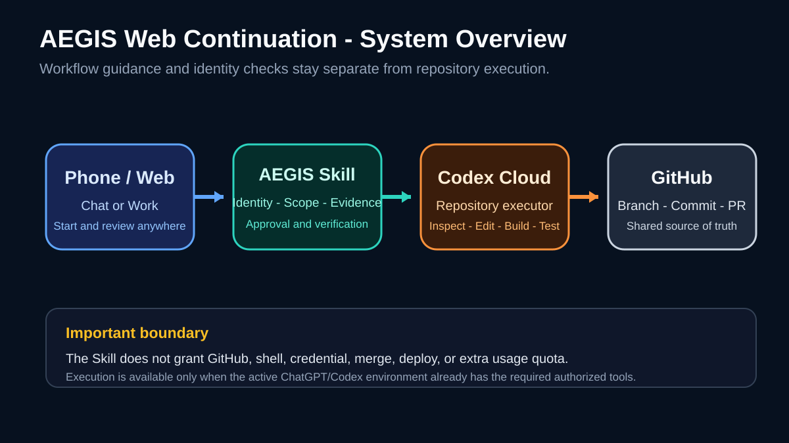
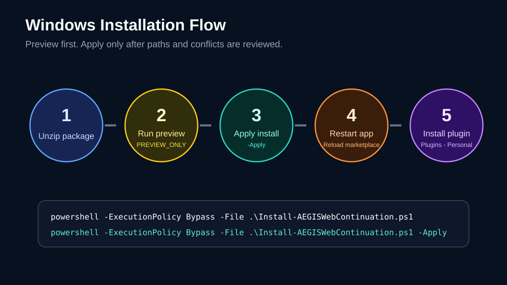
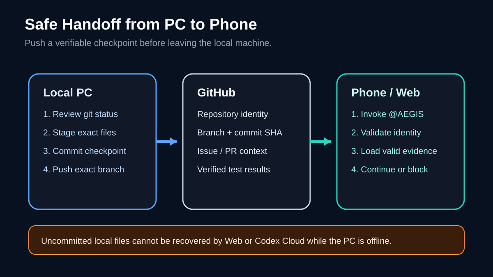
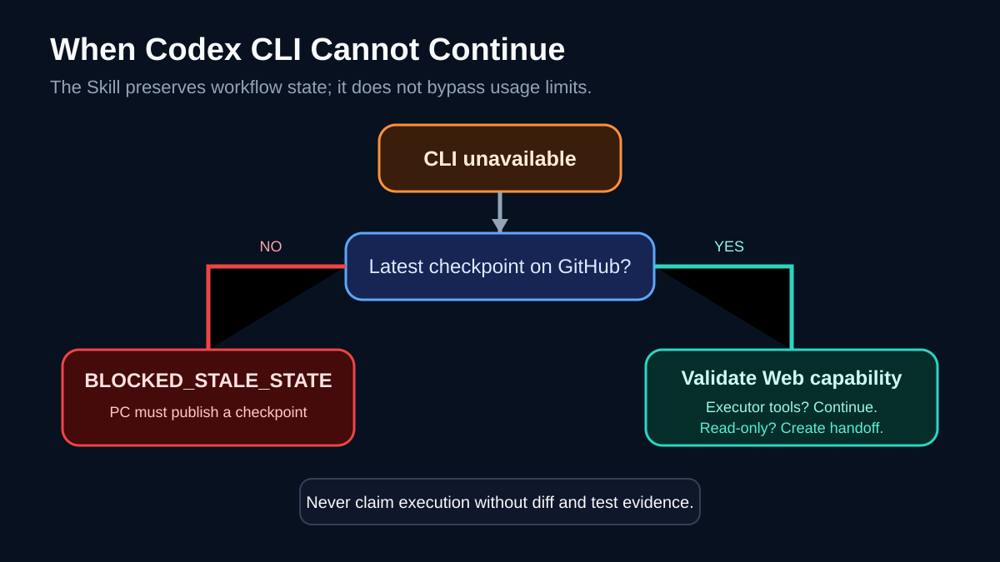

# คู่มือติดตั้งและใช้งาน AEGIS Web Continuation

เวอร์ชันเอกสาร: 2026-08-30

คู่มือนี้อธิบายวิธีติดตั้ง Skill, เชื่อม repository และรับช่วงงานจากโทรศัพท์เมื่อไม่ได้เปิดคอมพิวเตอร์หรือเมื่อ Codex CLI ทำงานต่อไม่ได้

คู่มือภาพ PDF สำหรับเปิดอ่านบนมือถือ: [AEGIS-Web-Continuation-Visual-Guide.pdf](../output/pdf/AEGIS-Web-Continuation-Visual-Guide.pdf) (ป้ายกำกับในภาพเป็นภาษาอังกฤษ ส่วนคำอธิบายฉบับเต็มอยู่ในหน้านี้)



## 1. เข้าใจก่อนติดตั้ง

AEGIS Web Continuation เป็น Skills-only plugin หน้าที่ของมันคือกำหนดขั้นตอนรับช่วงงานให้ปลอดภัยและตรวจสอบได้ ไม่ใช่เครื่องมือ shell หรือ GitHub connector

| ส่วน | หน้าที่ | สิ่งที่ไม่ทำ |
| --- | --- | --- |
| AEGIS Web Continuation Skill | ตรวจ identity, scope, evidence, approval และ verification | ไม่สร้างสิทธิ์ repository หรือ shell |
| ChatGPT Chat/Work | รับคำสั่ง วางแผน วิเคราะห์และ review | แก้ repo ไม่ได้หาก session ไม่มี executor tools |
| Codex cloud environment | clone repo, inspect, edit, build และ test ตาม permission | ไม่เห็นไฟล์ local ที่ยังไม่ push |
| GitHub | source of truth สำหรับ branch, commit, Issue และ PR | ไม่แทน AEGIS approval |
| Codex CLI | executor บนเครื่อง | ใช้ไม่ได้จากมือถือเมื่อเครื่องปิด |

ผลลัพธ์ที่คาดหวังมีสองระดับ:

- **Executor mode:** session มี repository access และ edit/build/test tools จึงทำงานและสร้าง diff ได้
- **Analyst mode:** session อ่านข้อมูลได้แต่ไม่มี executor tools จึงวิเคราะห์ สร้างแผน/patch/handoff และรายงานข้อจำกัดเท่านั้น

## 2. เตรียมความพร้อม

### 2.1 บน Windows

- ติดตั้ง ChatGPT desktop app และลงชื่อเข้าใช้บัญชีเดียวกับ Web/Mobile
- ใช้ Windows PowerShell ที่มากับ Windows ได้
- แตก ZIP ไว้ในโฟลเดอร์ที่คุณเลือกเอง
- ปิดงานสำคัญอื่นก่อน restart แอปหลังติดตั้ง

### 2.2 บน GitHub

- repository ต้องมีงานล่าสุดที่ต้องการให้ระบบอ่าน
- branch และ commit ต้องระบุได้จริง
- งานที่ยังไม่ได้ commit/push อยู่เฉพาะในเครื่องจะไม่ปรากฏใน Codex cloud
- ให้สิทธิ์เฉพาะ repository ที่ต้องทำงาน

### 2.3 ข้อมูลที่ควรมีใน task

- `owner/repository`
- branch ที่แน่นอน
- commit SHA ปัจจุบัน หรือ Issue/PR URL/number
- objective
- in scope / out of scope
- acceptance criteria
- verification ที่ต้องรัน
- งานที่ต้อง approval เช่น credential, network, merge หรือ deploy

## 3. ติดตั้ง Plugin บน Windows



### ขั้นที่ 1: แตก ZIP

แตก `AEGIS-Web-Continuation-Plugin-v1.0.zip` แล้วเข้าโฟลเดอร์ `AEGIS-Web-Continuation-Plugin-v1.0`

ตรวจว่ามีไฟล์ต่อไปนี้:

```text
Install-AEGISWebContinuation.ps1
Uninstall-AEGISWebContinuation.ps1
plugins\aegis-web-continuation\.codex-plugin\plugin.json
```

### ขั้นที่ 2: เปิด PowerShell ในโฟลเดอร์แพ็กเกจ

ใช้ File Explorer เปิดโฟลเดอร์แพ็กเกจ จากนั้นคลิกช่อง address bar พิมพ์ `powershell` แล้วกด Enter หรือเปิด PowerShell แล้ว `cd` ไปยังโฟลเดอร์จริง

### ขั้นที่ 3: Preview

รันคำสั่งนี้ก่อนทุกครั้ง:

```powershell
powershell -ExecutionPolicy Bypass -File .\Install-AEGISWebContinuation.ps1
```

ตรวจ output:

- มี `Plugin destination`
- มี `Marketplace`
- มี `PREVIEW_ONLY`
- ไม่มีข้อความว่าไฟล์ถูกติดตั้งแล้ว

หากพบ `PLUGIN_CONFLICT` หรือ `MARKETPLACE_CONFLICT` ให้หยุดและตรวจไฟล์เดิม ห้ามลบหรือ overwrite เพื่อแก้ผ่านแบบไม่ตรวจสาเหตุ

### ขั้นที่ 4: Apply

เมื่อ path ถูกต้องแล้ว:

```powershell
powershell -ExecutionPolicy Bypass -File .\Install-AEGISWebContinuation.ps1 -Apply
```

Installer จะเพิ่ม plugin ที่:

```text
$HOME\plugins\aegis-web-continuation
```

และเพิ่ม entry แบบ additive ใน:

```text
$HOME\.agents\plugins\marketplace.json
```

Installer ไม่แก้ `config.toml`, AGENTS.md, Skills เดิม, MCP เดิม, repository, GitHub permission หรือ credential

### ขั้นที่ 5: ตรวจไฟล์หลังติดตั้ง

```powershell
Test-Path "$HOME\plugins\aegis-web-continuation\.codex-plugin\plugin.json"
Test-Path "$HOME\.agents\plugins\marketplace.json"
```

ทั้งสองคำสั่งควรคืน `True`

อ่านเฉพาะ entry ที่ติดตั้ง:

```powershell
$marketplace = Get-Content -Raw "$HOME\.agents\plugins\marketplace.json" | ConvertFrom-Json
$marketplace.plugins | Where-Object { $_.name -eq "aegis-web-continuation" }
```

### ขั้นที่ 6: เปิดใช้ใน Plugins Directory

1. ปิด ChatGPT desktop app ให้หมด แล้วเปิดใหม่
2. เปิด Plugins Directory
3. เลือก Personal หรือชื่อ local marketplace ที่แสดง
4. เปิด `AEGIS Web Continuation`
5. กดปุ่ม `+` เพื่อติดตั้ง
6. เริ่ม chat ใหม่
7. พิมพ์ `@` และเลือก Skill

ตามเอกสาร OpenAI ปัจจุบัน Plugin ที่ติดตั้งแล้วควรใช้ใน chat ใหม่ และพิมพ์ `@` เพื่อเลือก plugin/skill โดยตรง

## 4. ทำให้พร้อมใช้บน Web และมือถือ

Local marketplace ถูกออกแบบสำหรับ authoring/testing และ availability อาจต่างกันระหว่าง desktop, web และ mobile ดังนั้นให้ตรวจตามลำดับนี้:

1. ยืนยันว่า Plugin ใช้ได้ใน chat ใหม่บน ChatGPT desktop
2. เปิด ChatGPT Web ด้วยบัญชีและ workspace เดียวกัน
3. เปิด chat ใหม่ พิมพ์ `@` แล้วค้นหา `AEGIS Web Continuation`
4. ทำซ้ำบนแอป ChatGPT Mobile

หากไม่พบ:

- ตรวจว่าอยู่บัญชีและ workspace เดียวกัน
- ตรวจ workspace policy ว่าอนุญาต Plugins/Skills
- restart desktop แล้วติดตั้งจาก Personal อีกครั้ง
- หากต้องการให้ทั้ง workspace ใช้ ต้องให้ workspace admin publish local plugin ไปยัง workspace
- หากต้องการแจกแบบ universal ต้องผ่านกระบวนการ publish/review ของ Plugin Directory ไม่ใช่เพียง ZIP local

ห้ามอ้างว่า mobile พร้อมใช้งานจนกว่าจะมองเห็น Skill ใน `@` selector ของบัญชีเป้าหมายจริง

## 5. เชื่อม GitHub กับ Codex cloud

Skill อย่างเดียวไม่สามารถแก้ repository ได้ ขั้นตอน executor ต้องตั้งแยก:

1. เปิด Codex cloud และลงชื่อเข้าใช้
2. เชื่อม GitHub เมื่อระบบร้องขอ
3. เลือกเฉพาะ repository ที่อนุญาต
4. เปิด environment settings
5. สร้าง environment สำหรับ repository ที่เลือก
6. กำหนด dependency/setup/variable/secret จากค่าจริงของโปรเจกต์เท่านั้น
7. เริ่ม task ทดสอบแบบ read-only:

```text
ตรวจ repository, branch และ HEAD commit เท่านั้น
ห้ามแก้ไฟล์ ห้ามสร้างไฟล์ ห้าม push หรือเปิด PR
รายงานสิทธิ์และ tools ที่ session นี้มีจริง
```

ผ่านเมื่อระบบรายงาน repository, branch และ commit ตรงกับ GitHub โดยไม่มี mutation

## 6. เตรียม checkpoint ก่อนออกจากคอมพิวเตอร์



รันใน repository ที่ถูกต้อง:

```powershell
git status --short
git branch --show-current
git rev-parse HEAD
```

ถ้ามีไฟล์ที่ตั้งใจส่งต่อ ให้ stage เฉพาะไฟล์จริง:

```powershell
git add <exact-file-1> <exact-file-2>
git commit -m "checkpoint: <short-description>"
git push origin <exact-branch>
```

อย่าใช้ `git add .` หากยังไม่ได้ตรวจทุกไฟล์ และอย่าเดา branch

จากนั้นบันทึกใน Issue/PR หรือ AEGIS task:

```text
Repository: <owner/repo>
Branch: <exact-branch>
Commit: <exact-sha>
Completed: <verified work>
Pending: <remaining work>
Tests: <commands and results>
Blocked: <reason or none>
Next action: <single next step>
```

## 7. สั่งงานจากโทรศัพท์

### 7.1 รับช่วงและตรวจสถานะก่อน

```text
@AEGIS Web Continuation
รับช่วงงาน repository <owner/repo>
branch <exact-branch> commit <exact-sha>
อ้างอิง Issue/PR <URL-or-number>

เริ่มแบบ read-only:
1. ตรวจ repository/branch/commit
2. ตรวจ Task/Session/Envelope/Project identity ถ้ามี AEGIS state
3. ตรวจว่างานที่ระบุว่าเสร็จมี evidence จริง
4. รายงาน capability ที่ session มี
5. ห้าม mutate จนกว่าจะได้ READY_TO_CONTINUE
```

### 7.2 สั่งทำงานต่อเมื่อ identity ตรง

```text
@AEGIS Web Continuation
ใช้ checkpoint ที่ตรวจแล้ว ทำเฉพาะ Pending ต่อไปนี้:
- <งานที่ 1>
- <งานที่ 2>

In scope:
- <paths/modules>

Out of scope:
- config, credential, deploy, unrelated refactor

Acceptance criteria:
- <ผลที่ตรวจได้>

ก่อนแก้ให้เสนอ Mutation Plan
หลังแก้ให้รัน targeted tests และส่ง diff + verification
ห้าม merge/push/deploy โดยไม่มี explicit approval
```

### 7.3 ขอ review อย่างเดียว

```text
@AEGIS Web Continuation
Review diff ของ <PR URL> เท่านั้น
ตรวจ correctness, regression, security boundary และ test evidence
ห้ามแก้ไฟล์ ห้าม merge ห้าม deploy
รายงานเฉพาะ findings ที่มีหลักฐาน พร้อม file/symbol หรือ changed hunk
```

## 8. เมื่อ Codex CLI token/usage หมด



Skill ไม่สามารถข้าม quota หรือทำให้ token กลับมา แต่ช่วยเปลี่ยน executor โดยไม่สูญเสีย state:

1. ตรวจว่างานล่าสุดถูก push ไป GitHub แล้ว
2. เปิด ChatGPT Web/Mobile และ Codex cloud ด้วยบัญชีที่มี access
3. เรียก Skill พร้อม repository/branch/commit/checkpoint
4. ให้เริ่ม read-only validation
5. ถ้า session มี edit/build/test tools จึงเข้าสู่ executor mode
6. ถ้าไม่มี tools ให้ใช้ analyst mode เพื่อสร้างแผน, patch หรือ handoff รอ executor

| สถานการณ์ | ผลที่ถูกต้อง |
| --- | --- |
| งานล่าสุด push แล้ว + Codex cloud พร้อม | รับช่วงและทำต่อได้หลัง validation |
| งานอยู่เฉพาะเครื่องที่ปิด | `BLOCKED_STALE_STATE` หรือขอให้ push checkpoint |
| Web อ่าน repo ได้แต่แก้ไม่ได้ | analyst/reviewer; ห้าม claim ว่าแก้แล้ว |
| ไม่มี repo access | `BLOCKED_REPO_ACCESS` |
| Task ขัด security contract | `BLOCKED_SECURITY_CONFLICT` |
| ต้องใช้ credential/network/merge/deploy | `NEEDS_APPROVAL` |

## 9. Status ที่ Skill ใช้

| Status | ความหมาย | สิ่งที่ต้องทำต่อ |
| --- | --- | --- |
| `READY_TO_CONTINUE` | identity/evidence/scope เพียงพอ | เสนอ Mutation Plan แล้วทำเฉพาะ scope |
| `READY_REVIEW` | มี diff และ verification พร้อมตรวจ | review ก่อน merge |
| `BLOCKED_REPO_ACCESS` | session เข้า repository ไม่ได้ | เชื่อม/อนุญาต repo ที่ถูกต้อง |
| `BLOCKED_STALE_STATE` | commit/evidence/checkpoint ไม่ตรง | push หรือสร้าง checkpoint ใหม่ |
| `BLOCKED_SECURITY_CONFLICT` | task ขัด security rule | แก้ task/contract อย่างชัดเจน |
| `NEEDS_APPROVAL` | operation ต้องอนุมัติ | ผู้ใช้ review แล้วอนุมัติแบบ explicit |

## 10. Troubleshooting

### Plugin ไม่แสดงบน Desktop

```powershell
Test-Path "$HOME\plugins\aegis-web-continuation\.codex-plugin\plugin.json"
Get-Content -Raw "$HOME\.agents\plugins\marketplace.json"
```

- ถ้า `Test-Path` เป็น `False` ให้รัน installer preview แล้ว apply ใหม่
- ถ้า JSON อ่านไม่ได้ ให้หยุด อย่า overwrite และกู้จากไฟล์ `.aegis-backup-*`
- ปิด/เปิด ChatGPT desktop แล้วเริ่ม chat ใหม่

หาก `codex plugin marketplace list` รายงาน `expected value at line 1 column 1` ทั้งที่ PowerShell อ่าน JSON ได้ แสดงว่าไฟล์อาจมี UTF-8 BOM จาก Windows PowerShell รุ่นเดิม ให้ backup และเขียน encoding ใหม่แบบ UTF-8 without BOM:

```powershell
$path = "$HOME\.agents\plugins\marketplace.json"
$content = [IO.File]::ReadAllText($path)
$content | ConvertFrom-Json | Out-Null
Copy-Item -LiteralPath $path -Destination "$path.before-utf8-fix-$(Get-Date -Format 'yyyyMMdd-HHmmss')"
$temp = "$path.tmp-$([guid]::NewGuid().ToString('N'))"
$utf8NoBom = New-Object System.Text.UTF8Encoding($false)
[IO.File]::WriteAllText($temp, $content, $utf8NoBom)
Move-Item -LiteralPath $temp -Destination $path -Force
codex plugin marketplace list
```

Installer/Uninstaller ในแพ็กเกจนี้เขียน marketplace เป็น UTF-8 without BOM เพื่อรองรับ Windows PowerShell 5.1

### Plugin แสดงบน Desktop แต่ไม่แสดงบน Web/Mobile

- ยืนยัน account/workspace เดียวกัน
- ตรวจ Plugins/Skills policy
- local marketplace availability อาจไม่เท่ากันทุก surface
- ใช้ workspace publishing โดย admin หากต้องการ distribution ภายในทีม

### Skill พบ repository แต่ commit ไม่ตรง

หยุด mutation แล้วเปรียบเทียบ:

```powershell
git branch --show-current
git rev-parse HEAD
git status --short
```

อัปเดต checkpoint จากค่าจริง ห้ามเปลี่ยน task ให้ตรงกับค่าที่เดา

### ChatGPT บอกว่าทำเสร็จแต่ไม่มี diff/test

ขอผลลัพธ์ใหม่ด้วย:

```text
แสดง repository/branch/commit ที่ใช้, changed files, concise diff,
คำสั่ง verification, exit status และข้อที่ยัง NOT VERIFIED
ห้ามถือข้อความสรุปว่าเสร็จเป็น verification
```

## 11. ถอนติดตั้งและ rollback

Preview:

```powershell
powershell -ExecutionPolicy Bypass -File .\Uninstall-AEGISWebContinuation.ps1
```

Apply:

```powershell
powershell -ExecutionPolicy Bypass -File .\Uninstall-AEGISWebContinuation.ps1 -Apply
```

Uninstaller จะหยุดด้วย `PLUGIN_MODIFIED` หาก plugin ที่ติดตั้งถูกแก้หลังติดตั้ง เพื่อป้องกันการลบงานที่ไม่ตรงกับแพ็กเกจ

## 12. Checklist พร้อมใช้งานจริง

- [ ] Installer preview ไม่มี conflict
- [ ] Installer apply สำเร็จ
- [ ] Plugin แสดงใน Desktop Plugins Directory
- [ ] Skill เลือกผ่าน `@` ใน chat ใหม่ได้
- [ ] Skill แสดงบน Web/Mobile ของ account/workspace เป้าหมาย
- [ ] GitHub เชื่อมเฉพาะ repository ที่ต้องใช้
- [ ] Codex cloud environment เปิด repository ได้
- [ ] Read-only identity test รายงาน repo/branch/commit ถูกต้อง
- [ ] ทดสอบ analyst mode เมื่อไม่มี edit tools
- [ ] ทดสอบ executor mode ด้วยงานเล็กและ review diff ก่อน merge
- [ ] ยืนยันว่า merge/push/deploy ยังต้อง explicit approval

## 13. เอกสารอ้างอิง OpenAI

- Build skills: https://learn.chatgpt.com/docs/build-skills
- Plugins: https://learn.chatgpt.com/docs/plugins
- Codex cloud: https://learn.chatgpt.com/docs/cloud
- Package plugins: https://developers.openai.com/plugins/build/plugins
